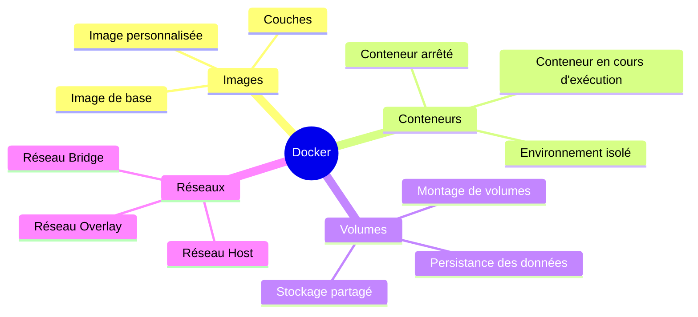

# Docker
Docker est une technologie révolutionnaire qui apporte de nombreux avantages aux développeurs et aux entreprises en facilitant la gestion et le déploiement d'applications dans des environnements cohérents et reproductibles.

## Pour les **développeurs**
Docker simplifie considérablement le processus de développement en permettant de créer des environnements isolés pour chaque application. Les conteneurs Docker encapsulent toutes les dépendances nécessaires (bibliothèques, frameworks, configurations) dans une image légère, garantissant que l'application s'exécute de la même manière sur toutes les machines, qu'il s'agisse d'un environnement de développement, de test ou de production. Cela réduit le classique problème de "ça fonctionne chez moi mais pas en production". De plus, Docker permet une itération rapide en facilitant l'intégration continue et les tests automatiques. Les développeurs peuvent tester différents environnements, outils ou configurations sans impacter leur système hôte, ce qui améliore la productivité.

## Pour les **entreprises**
Docker offre une meilleure efficacité des ressources et une grande flexibilité. Les conteneurs sont légers et utilisent peu de ressources, permettant de faire tourner plusieurs services sur une même machine, contrairement aux machines virtuelles plus lourdes. Cela réduit les coûts d'infrastructure. Docker améliore également l'évolutivité des applications. Les entreprises peuvent facilement déployer et gérer des microservices grâce à Docker, en isolant chaque composant pour un déploiement indépendant. En plus, Docker s'intègre parfaitement aux outils DevOps, facilitant la livraison continue et le déploiement rapide d'applications.

En résumé, Docker accélère le cycle de développement, simplifie la gestion des environnements, optimise l'utilisation des ressources, et permet aux entreprises de déployer des applications plus rapidement et à moindre coût.