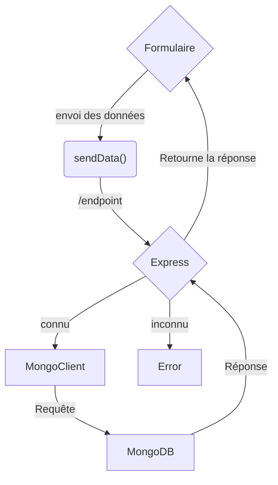

import { FileTree } from 'nextra/components'
import { Callout } from 'nextra/components'
 

# MongoDB-TP-TW3

## Ressources :
- [CodeSandbox](https://codesandbox.io/) est une plateforme en ligne offrant un environnement de développement collaboratif basé sur le cloud.
  
- L'image Docker officielle de MongoDB peut être trouvée sur le [Hub Docker - MongoDB](https://hub.docker.com/_/mongo), offrant une solution prête à l'emploi pour le déploiement de bases de données MongoDB dans des conteneurs Docker.

- [Express](https://www.npmjs.com/package/express/) est un framework web minimaliste et flexible pour Node.js, permettant de créer des applications web robustes et évolutives.

- [MongoDB](https://www.npmjs.com/package/mongodb/) est un système de gestion de base de données NoSQL orienté document.

- [Body-Parser](https://www.npmjs.com/package/body-parser) est un middleware Node.js facilitant le traitement des données du corps des requêtes HTTP dans une application Express.

## Étapes :
- Créer un devBox Node.js sur [codesandBox](https://codesandbox.io/dashboard/recent)
- Utiliser le cours pour installer mongoDB dans le codesandBox, et lancer un container docker mongo.
- Installer les dépendances (librairies), nécessaire au projet.
    ```sh npm2yarn copy
    npm i express mongodb body-parser
    ```
- Créer les fichiers de base du projet :

<FileTree>
  <FileTree.Folder name="node-mongodb-docker" defaultOpen>
    <FileTree.Folder name="src" defaultOpen>
      <FileTree.File name="index.js" />
        <FileTree.Folder name="public" defaultOpen>
        <FileTree.File name="index.html" />
        <FileTree.File name="style.css" />
        <FileTree.File name="script.js" />
        </FileTree.Folder>
  </FileTree.Folder>
    <FileTree.File name="package.json" />
  </FileTree.Folder>
</FileTree>

<Callout type="warning" emoji="⚠️">
  Il y a des erreurs dans le code que je vous fourni, principalement du fait que j'ai fait évoluer l'exercice plusieurs fois. Vous allez devoir les identifier pour faire fonctionner le project 
  
  **vous pouvez/devez travailler tous ensembles**
</Callout>
## Création des fichiers

### public/index.html
```html filename="public/index.html" copy
<!DOCTYPE html>
<html lang="en">
<head>
  <meta charset="UTF-8">
  <meta name="viewport" content="width=device-width, initial-scale=1.0">
  <link rel="stylesheet" href="style.css">
  <title>Node.js MongoDB Docker</title>
</head>
<body>
  <h1>Hello, MongoDB!</h1>
  <div>
    <label for="dataInput">Data:</label>
    <input type="text" id="dataInput" />
    <button onclick="sendData()">Send Data</button>
  </div>
  <div id="output"></div>
  <script src="script.js"></script>
</body>
</html>
```
### public/style.css

```css filename="public/style.css" copy
body {
  font-family: Arial, sans-serif;
  margin: 20px;
}

h1 {
  color: #333;
}

div {
  margin-top: 20px;
}

label {
  font-weight: bold;
}

input {
  margin-right: 10px;
}

button {
  cursor: pointer;
}
```
### public/script.js

```js filename="public/script.js" copy
function sendData() {
  const dataInput = document.getElementById('dataInput');
  const outputDiv = document.getElementById('output');

  const data = dataInput.value;

  // Utilisez fetch pour envoyer des données au serveur
  fetch('/sendData', {
    method: 'POST',
    headers: {
      'Content-Type': 'application/json',
    },
    body: JSON.stringify({ data }),
  })
  .then(response => response.json())
  .then(result => {
    outputDiv.innerText = `Server Response: ${result.message}`;
  })
  .catch(error => {
    console.error('Error sending data:', error);
  });
}
```
### src/index.js
```js filename="src/index.js" copy
const express = require('express');
const { MongoClient } = require('mongodb');
const bodyParser = require('body-parser');

const app = express();
const PORT = process.env.PORT || 3000;

const mongoUrl = 'mongodb://mongo:27017/mydatabase';

app.use(bodyParser.json());

app.use(express.static("public"));

app.post('/addData', async (req, res) => {
  const dataContent = req.body.data;

  try {
    // Établir une connexion avec la base de données
    const client = new MongoClient(mongoUrl, { useNewUrlParser: true, useUnifiedTopology: true });
    await client.connect();

    // Sélectionner la collection
    const collection = client.db().collection('data');

    // Insérer une nouvelle donnée dans la collection
    await collection.insertOne({ content: dataContent });

    // Fermer la connexion
    await client.close();

    res.json({ message: 'Data added successfully' });
  } catch (error) {
    console.error('Error adding data:', error);
    res.status(500).json({ error: 'Internal Server Error' });
  }
});
// ... (autres routes)
```




## Objectifs

Développer le projet créé en utilisant deux documents (cf: [modélisation](/modelisation/modelisation)) :

pet et owner pour reprendre le TP précédent, vous pourrez réutiliser un structure connu et simple, ce qui vous permettra de vous concentrer sur l'essentiel.
